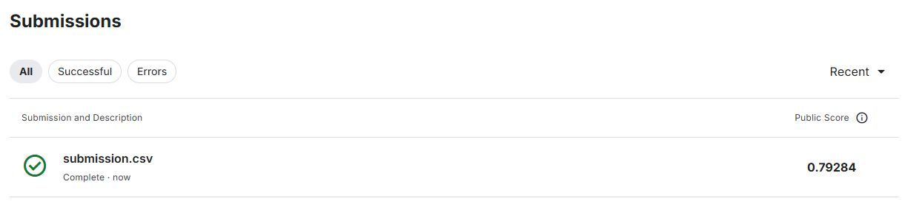

# Trabalho para a disciplina de Machine Learning do curso de mestrado no IFES

## Jupyter notebook

O arquivo Kaggle_Spaceship_Titanic_scikit_v2.ipynb é um jupyter notebook com o código fonte que gerou a submissão para o [Kaggle](kaggle.com).

## Submission

A submissão gerou um score de 79.2%

## Video

O arquivo spaceship-titanic.mp4 é o vídeo descrevendo o código-fonte, que também pode ser encontrado em [https://youtu.be/alu7CNNUvsU](https://youtu.be/alu7CNNUvsU).
